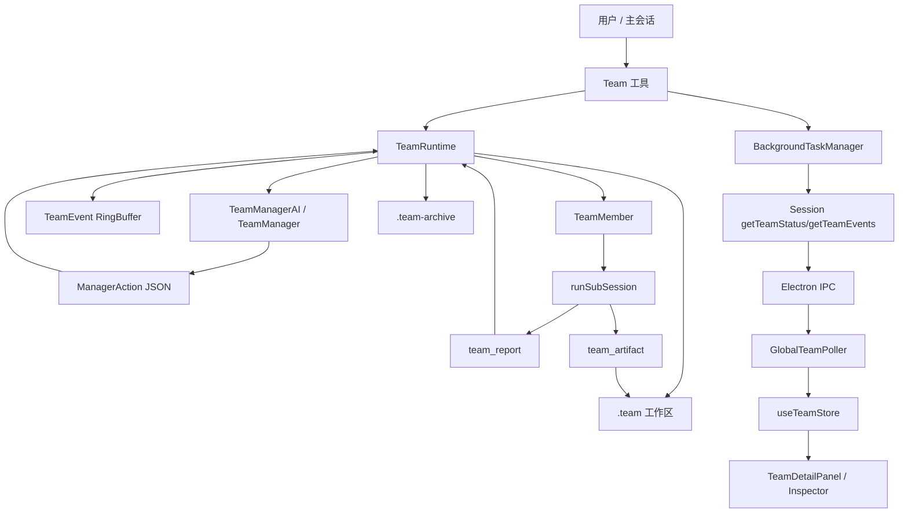

# Team 模型实现文档

本文整理项目中 Team 模型的当前实现, 覆盖 core 运行时、工具入口、Electron IPC、前端状态与交互, 并给出后续可改进方向。

## 1. 模型定位

Team 模式是 Pudding Agent 的多智能体协作能力。它把一个复杂目标交给一个后台团队执行, 团队内部由 Project Manager AI 负责任务拆解、成员招聘、任务分配、过程干预、质量检查与最终汇总; worker 以子会话形式并行执行具体任务。

与普通 Agent 工具的区别:

- Agent: 单个后台 worker, 适合单一、可独立完成的任务。
- Team: 多个 worker + PM 协调 + 共享工作区 + 实时事件 + 用户干预 + 最终综合产出。

入口约束写在 `packages/core/src/base-prompt.ts` 和 `packages/core/src/tools/team.ts` 中: 只有目标足够明确、任务复杂度适合多人协作, 或用户明确要求 team/开团队时才创建团队。创建后主会话应等待团队完成, 不应并行重做团队目标。

## 2. 代码结构

核心文件:

| 模块 | 文件 | 作用 |
| --- | --- | --- |
| 类型定义 | `packages/core/src/team/team-types.ts` | Team/Member/Task/Event/Artifact/Workspace frontmatter 类型 |
| 工具入口 | `packages/core/src/tools/team.ts` | `Team` 工具定义、参数校验、运行时创建 |
| 运行时总控 | `packages/core/src/team/team-runtime.ts` | 生命周期、tick 调度、任务分配、worker 管理、超时、归档、质量门 |
| PM 基类 | `packages/core/src/team/team-manager.ts` | 任务状态机、基础 round-robin 决策、用户干预处理 |
| AI PM | `packages/core/src/team/team-manager-ai.ts` | LLM 驱动的 PM 决策、prompt、动作 JSON 解析、主动触发与节流 |
| Worker | `packages/core/src/team/team-member.ts` | 子会话包装、工具事件上报、team_report/team_artifact 注入 |
| 并发控制 | `packages/core/src/team/team-concurrency.ts` | worker 数量限制、按 agentType 限流、文件锁接口 |
| 共享工作区 | `packages/core/src/team/team-workspace.ts` | `.team/` 目录、任务/产物/合同/问题文件读写与归档 |
| 通信缓冲 | `packages/core/src/team/team-mailbox.ts` | worker mailbox 与事件 ring buffer |
| 技能路由 | `packages/core/src/team/skill-router.ts` | 根据 objective 给 PM/worker 注入最多一个 skill 方法论 |
| 后台任务 | `packages/core/src/background-tasks.ts` | 把 team 作为 background task 注册、存事件与消息 |
| Session 对接 | `packages/core/src/session.ts` | 注册 Team 相关工具, 暴露状态/事件/发消息接口 |
| Electron IPC | `packages/electron/src/preload.ts`, `packages/electron/src/ipc-handlers.ts`, `packages/electron/src/session-manager.ts` | 前端获取 team 状态、事件与发送干预消息 |
| 前端 store | `packages/ui/src/stores/team-store.ts` | 保存 team snapshot、事件日志、PM 对话流、当前选中 team |
| 前端轮询 | `packages/ui/src/components/GlobalTeamPoller.tsx` | 全局轮询所有 team, 将事件翻译成 UI 对话 |
| 前端面板 | `packages/ui/src/components/TeamDetailPanel.tsx`, `packages/ui/src/components/Inspector.tsx` | Team 检查器、成员/任务/事件/对话展示与快捷干预 |

## 3. 整体架构



## 4. 核心数据模型

### 4.1 TeamStatus

`TeamStatus` 定义团队整体状态:

- `planning`: 初始化或 PM 正在规划。
- `running`: 已启动, 可调度任务。
- `waiting`: 等待事件或成员结果。
- `synthesizing`: 正在汇总。
- `completed`: 成功完成。
- `failed`: 失败。
- `stopped`: 被停止。

实现上 `TeamRuntime.status` 是最终状态源, 前端通过 `Session.getTeamStatus()` 获取。

### 4.2 TeamMember

成员状态由 `TeamMemberState` 表示:

- `id`, `name`, `role`, `responsibility`: UI 展示与 prompt 注入。
- `agentType`: 决定工具能力边界, 如 `explore`, `plan`, `refactor`, `security-auditor`, `frontend-designer`, `general`。
- `capabilities`: 由 agentType 派生, 包含 `read/write/shell` 等。
- `currentTaskId`: 当前任务。
- `status`: `queued/running/waiting/blocked/completed/failed/stopped`。
- `toolCount`, `lastActivityAt`: 前端展示与超时检测。

成员不是长期运行的线程。每次任务分配时, `TeamRuntime.assignTask()` 会用同一个 memberId 创建一个带具体 taskPrompt 的新 `TeamMember` 实例; 完成后 `recycleMember()` 再把它变回 queued 状态。

### 4.3 TeamTask

任务由 `TeamTask` 表示:

- `id`, `title`, `description`: 任务基本信息。
- `status`: `todo/assigned/running/blocked/completed/failed/cancelled/reopened`。
- `assigneeId`: 当前负责人。
- `dependsOn`: 依赖任务, 用于串行化合同、QA、同文件写入等。
- `priority`, `riskLevel`: 调度参考。
- `result`, `lastError`, `failureCount`: 完成、失败与重试判断。

`TeamManager` 负责维护任务 Map, 提供 `addTask`, `markTaskAssigned`, `markTaskRunning`, `markTaskCompleted`, `markTaskFailed`, `reopenTask`, `cancelTask` 等状态变更。

### 4.4 TeamEvent

Team 事件用于后端状态观察和前端实时渲染。主要事件包括:

- 团队: `team_started`, `team_synthesizing`, `team_completed`, `team_failed`
- PM: `manager_decision`, `manager_reply`, `intervention_received`
- 成员: `member_created`, `member_added`, `member_removed`, `member_progress`
- 任务: `task_created`, `task_assigned`, `task_completed`, `task_cancelled`, `task_failed`
- 工具: `tool_start`, `tool_complete`, `tool_error`
- 通信: `message_sent`

事件先写入 `TeamRuntime.events`, 再通过 `onEvent` 同步到 `BackgroundTaskManager.eventBuffers`, 前端最终通过 IPC 拉取。

### 4.5 TeamMessage

TeamMessage 是主会话、用户、PM、成员之间的通信用结构:

- `from`: `user/main_session/manager/member/system`
- `to`: `team/manager/member:<id>`
- `intent`: `message`, `hurry`, `wrap_up`, `request_status`, `question`, `finding`, `assign`, `schedule` 等
- `priority`: `low/normal/high/urgent`

用户从前端面板发出的消息会进入 `Session.sendTeamMessage()` 和 `TeamRuntime.sendMessage()`, 然后由下一个 tick 交给 PM 处理。

## 5. 启动流程

1. 主会话调用 `Team` 工具。
2. `createTeamTool.execute()` 校验 objective 长度, 并检查当前 session 是否已有 active team。
3. 解析可选 members/tasks/maxWorkers/timeoutMinutes/archive_path。
4. 对成员 expertPrompt 做 preset 解析或基于 role/responsibility 自动推断。
5. 调用 `BackgroundTaskManager.registerTeam()` 注册后台任务, 得到 teamId。
6. 通过 `skill-router` 可选选择 PM/worker skill 文本。
7. 创建 `TeamRuntime`, 注入:
   - objective 与 plan
   - sub-session 依赖
   - AI PM provider/modelConfig
   - skillInjection
   - onEvent/onComplete/onFail 回调
8. 注册到 `TeamRegistry`。
9. `team.start()` 初始化 `.team/`, 写入 initial task 文件, 发出 `team_started`。
10. PM 收到 `team_started` 主动触发, 开始招聘成员、拆任务、分配任务。

## 6. 调度与执行流程

### 6.1 Runtime tick

`TeamRuntime.scheduleTick()` 使用 `queueMicrotask()` 合并调度请求。`tick()` 的核心顺序:

1. drain runtime mailbox, 将用户/主会话/成员消息交给 PM。
2. 消费 AI PM 已生成的 `pendingAIActions`。
3. 找出 queued 且符合并发策略的成员。
4. 调用 `manager.decideTick()`。
5. 执行 ManagerAction。
6. 检查 idle worker, 必要时触发 PM 主动评估。
7. 如果 wrap_up 后没有 active task/worker, 自动完成团队。

### 6.2 AI PM

`TeamManagerAI` 继承 `TeamManager`, 在 AI 可用时接管决策:

- `handleIntervention()`: 处理用户消息、主会话消息、worker report。
- `triggerProactiveCheck()`: 在 `team_started`, `task_added`, `task_completed`, `task_failed`, `worker_idle_timeout` 时主动决策。
- `processWithAI()`, `processProactive()`, `processStaffingFollowUp()`: 组装状态 dump 与 frame prompt, 调用 provider stream。
- `parseAIResponse()`: 提取最后一个 JSON array, 转成 `ManagerAction[]`。
- 连续 PM AI 失败后会关闭 AI PM, 回退到基类 round-robin 调度。

AI PM 的 prompt 分层包含:

- PM identity: PM 角色、团队模型、工作区、价值偏好、反模式。
- Action toolbox: PM 可输出的 JSON action。
- Output protocol: `<scratch>` + JSON array 的输出格式。
- trigger frame: 用户干预、worker report、team_started、task_completed、task_failed 等不同场景。

### 6.3 ManagerAction

Runtime 支持的主要动作:

- `add_member`, `remove_member`, `kick_member`
- `add_task`, `assign_task`, `cancel_task`, `reopen_task`
- `send_member_message`, `broadcast`, `reply`, `escalate_to_user`
- `add_constraint`, `complete`

这些动作全部由 `TeamRuntime.executeActions()` 解释执行。`reply` 事件在普通用户干预场景会转成 `manager_reply`, 而 proactive 场景的 reply 会降级为 `manager_decision`, 避免无端打扰主会话。

### 6.4 Worker 子会话

`TeamRuntime.assignTask()` 会构建 worker prompt, 内容包括:

- Team 身份与通信协议。
- team_report 与 team_artifact 使用规则。
- 专家身份 expertPrompt。
- Team objective。
- 成员 role/responsibility/agentType。
- PM kick hint, 如果是重启任务。
- reopened issue 内容, 如果任务被 QA reopen。
- 当前任务描述。
- locked contracts 全文。
- upstream artifact/result 摘要。
- worker skill 方法论。
- 必须产出 artifact 与 update_status 的完成契约。

然后 `TeamMember.start()` 调用 `runSubSession()`。worker 会获得标准工具和两个 team 专用工具:

- `team_report`: 发临时消息给 PM。
- `team_artifact`: 持久化产物、合同、问题、任务状态。

## 7. 共享工作区

Team 运行时在项目根目录创建 `.team/`:

```text
.team/
  objective.md
  README.md
  log.md
  contracts/
  issues/
  tasks/
    <taskId>/
      task.md
      result.md
      artifacts/
```

重要规则:

- `.team/` 内文件必须通过 `team_artifact` 写入, 不应由 worker 直接 Write/Edit。
- `task.md`, `result.md`, artifact, contract, issue 都使用 frontmatter 保存结构化状态。
- contract 会被 downstream task 自动注入全文。
- reopened task 会注入对应 open/in_progress issue 全文。
- 团队完成后 `.team/` 被移动到 `.team-archive/<teamId>-<timestamp>/`。
- 如果启动时发现已有 `.team/`, 会先归档为 stale 目录。

## 8. 超时、失败与质量门

### 8.1 task timeout

每个运行任务有 heartbeat-based timeout, 默认 10 分钟。只要 worker 有文本流、工具事件或 stream heartbeat, `lastActivityAt` 就会刷新。长时间无进展会 abort worker、标记任务失败、释放并发槽并回收成员。

### 8.2 team timeout

团队级 idle timeout 默认 60 分钟。它不是固定 deadline, 而是检查所有成员最近活动。如果团队确实 idle:

- 若已有 completed task, 会生成 partial summary 并标记 completed。
- 若没有完成任务, 标记 failed。

### 8.3 failure recovery

PM prompt 中要求:

- 低失败次数可 reopen。
- idle 或能力不匹配应换 worker 或重写任务。
- 失败次数过多应取消或升级给用户。

Runtime 里还有 `cascadeFailure()`: 如果某任务失败次数达到阈值, 会取消依赖它的 todo/reopened 下游任务。

### 8.4 quality gate

PM 输出 `complete` 时, `TeamRuntime.runQualityGate()` 会检查:

- 是否存在未替代的 failed task。
- summary 是否足够实质。
- 是否还有 running/assigned task。

最多拒绝 3 次, 之后会带 caveat 强制完成。

## 9. 并发模型

`TeamConcurrencyController` 默认策略:

```ts
{
  maxWorkersPerTeam: 10,
  maxActiveWorkers: 8,
  maxReadOnlyWorkers: 8,
  maxWriteWorkers: 5,
  maxShellWorkers: 2,
}
```

agentType 与并发桶:

- `explore`, `plan`: read-only。
- `security-auditor`: shell。
- `general`, `refactor`, `frontend-designer`: write。

控制器还提供文件锁接口 `acquireFileLock`, `releaseFileLock`, `isFileLocked`, 但当前代码路径主要依赖 PM prompt 的文件范围纪律, 文件锁尚未被工具层强制使用。

## 10. 与 Session/工具系统的集成

`Session` 注册的 Team 相关工具:

- `Team`: 创建团队。
- `background_send`: 给 team 发干预消息。
- `background_status`: 查询 team point-in-time 状态。
- `background_events`: 查询 team 事件日志。
- `team_list`: 列出团队。
- `team_add_task`: 给运行中团队新增任务。

Session 还做了两件关键事情:

- 将 PM、worker、skill-router 的 token usage 通过 `usageTracker.addSubAgentTurn()` 汇总进主会话用量。
- 在 `team_completed`, `team_failed`, `manager_reply` 时推送 pending notification, 让主会话知道团队完成或 PM 需要回复。

完成/失败时, runtime 会从 active registry 移到 archived registry。`Session.captureTeamFinalSnapshot()` 会在移除前保存最终快照, 前端刷新或团队结束后仍能展示成员和任务状态。

## 11. Electron IPC 与前端流程

IPC 暴露:

- `team:get-status`
- `team:get-events`
- `team:send`
- `team:state-changed`

前端流程:

1. `GlobalTeamPoller` 挂在 `App` 顶层, 对所有 background team 轮询。
2. 每 1.5 秒通过 IPC 拉取 status 与最近 200 条 events。
3. 写入 `useTeamStore.teams` 与 `useTeamStore.events`。
4. 将结构化事件翻译成 conversation entries, 用 dedupKey 去重。
5. `Inspector` 的 team tab 选择最新 running team 或用户手动选中的 team。
6. `TeamDetailPanel` 展示:
   - PM 状态
   - 成员列表
   - 任务列表
   - 对话流
   - 事件日志
   - 快捷动作: 催一下、阶段总结、收尾、缩小范围
7. 用户发送消息后, UI 先追加本地 sent entry, 然后调用 `teamSend`, 成功后标记 delivered。

## 12. 当前实现亮点

- PM 自主规划能力较完整: 能招聘成员、拆任务、处理 worker report、主动 QA/reopen、处理 wrap_up。
- worker 有明确完成协议: artifact + result + update_status, 下游任务能拿到结构化上下文。
- `.team/` 工作区把过程产物落盘, 团队完成后可归档追溯。
- 事件模型覆盖 PM、成员、任务、工具和用户干预, 前端能还原比较完整的执行过程。
- AI PM 有节流、队列与失败降级逻辑, 避免高频事件丢失或无限等待。
- 前端全局轮询不依赖面板是否打开, 可以持续收集 PM 回复和重要事件。

## 13. 可改进点

### P0: add_task action 字段兼容性需要统一

`TeamManagerAI` prompt 中示例输出是:

```json
{ "type": "add_task", "task": { "title": "...", "description": "..." } }
```

`parseAIResponse()` 会把 `task` 转成 `taskInput`, 但 `ManagerAction` 类型定义里字段叫 `taskInput`; 这属于运行时兼容、类型层不完全一致。建议:

- 将 `ManagerAction` 扩展为明确支持原始 AI action 与归一化 action 两层类型。
- 在 parser 后统一 normalize, Runtime 只接收 normalized action。
- 给 `parseAIResponse()` 增加单测覆盖 `task -> taskInput`, `content -> message`, 非法 action 过滤。

### P0: 文件锁尚未真正接入写工具

`TeamConcurrencyController` 有文件锁能力, 但 worker 写入普通项目文件时未看到强制 lock 流程。当前主要依赖 PM prompt 和任务描述中的 File scope 防止冲突, 这对 LLM 行为有效但不够硬。

建议:

- 在 worker 写工具调用前后接入 file lock。
- 对 `Edit/Write/MultiEdit` 的目标路径做跨 worker 冲突检测。
- 冲突时返回可恢复错误, 并发 `team_report` 或 `manager_decision` 给 PM 重新排程。

### P0: completed 后仍可能把非终态任务标 failed

`completeTeam()` 在标记 completed 后会 abort running worker, 并把 remaining non-terminal task 标 failed。这能避免 UI 卡在 running, 但在 PM 决定收尾或 partial completion 场景下, failed task 可能被误解为真正失败。

建议:

- 增加 `cancelled_due_to_completion` 或 `aborted_by_team_completion` 之类的语义。
- 最终 summary 中区分真实失败、被收尾取消、完成时中止。
- 前端 taskStats 单独展示 cancelled/aborted, 不混入 failed。

### P1: Team 状态持久化不足

TeamRegistry 和 runtime 在内存中, BackgroundTaskManager 也主要是进程内 Map。虽然 `.team/` 和 archive 保留了产物, 但 app 重启后无法恢复 active team 的运行态。

建议:

- 将 background tasks 与 team runtime snapshot 持久化到 session history。
- active team 至少恢复为 terminal/unknown 状态, 并展示 `.team/` 或 archive 路径。
- 对正在运行但进程重启的团队, 提供“已中断, 基于现有产物生成总结”的恢复动作。

### P1: 前端轮询可以改为事件推送

当前 `GlobalTeamPoller` 每 1.5 秒轮询所有 team status/events。团队数量不多时问题不大, 但事件天然是后端 push 模型。

建议:

- 后端 `onTeamEvent` 直接通过 `team:state-changed` 或专门的 `team:event` 推送。
- 前端只在初始化、重连、终态快照时拉取完整状态。
- 保留轮询作为 fallback, 降低 IPC 频率。

### P1: PM action schema 可以改成结构化校验

AI PM 输出 JSON 后只做轻量过滤, 缺少字段级校验。例如 `assign_task` 的 taskId/memberId 是否存在, `add_member` 是否包含 responsibility/expertPrompt, `dependsOn` 是否可解析, 当前有些错误依赖 runtime 容错或 prompt 约束。

建议:

- 引入 zod 或本地 schema validator。
- 对每类 action 做 normalize + validate + repair。
- validator 输出 manager_decision 事件, 便于排查 PM 的无效动作。

### P1: quality gate 规则偏弱

当前质量门主要检查 failed task、summary 长度、running/assigned task。它无法判断:

- write task 是否有 QA。
- contract 是否被消费者遵守。
- open issue 是否已解决。
- artifact 是否缺失或 summary 过空。

建议:

- 完成前扫描 `.team/issues` 是否仍有 open/in_progress。
- 对 write task 检查是否有后续 QA task 或明确豁免。
- 对每个 completed task 检查 result.md 和至少一个 artifact。
- 对 contract 相关任务检查 related_tasks 与 dependsOn 链路。

### P1: UI 类型使用 any 较多

`TeamDetailPanel` 和 `GlobalTeamPoller` 中存在较多 `any`, 与 `TeamStatusUI`/event union 没有完全打通。

建议:

- 将 core 的 TeamEvent 类型以共享包或生成类型暴露给 UI。
- 前端 formatEvent 和 conversation builder 使用 exhaustiveness check。
- 对未知事件提供 fallback, 同时在开发模式 warning。

### P2: team_add_task 参数名容易混淆

`team_add_task` 中 `task_id` 实际表示 Team ID, 这和 taskId 命名语义冲突。

建议:

- 新增 `team_id` 参数, 保留 `task_id` 兼容旧调用。
- 文档和工具描述中统一叫 team_id。

### P2: Skill router 只能选一个 PM skill 和一个 worker skill

当前设计保守、安全, 但复杂任务可能同时需要多个方法论, 如 UI 实现 + Playwright 测试 + 文档生成。

建议:

- 保持默认最多一个, 但允许高置信度场景返回小列表。
- 给 PM 和 worker 分开设置 token budget。
- 在 UI/事件中记录实际注入的 skill, 方便调试。

### P2: archive 可发现性不足

团队完成后 archive 路径只进入最终 summary。前端没有专门展示 archive 入口, 用户不容易回看 `.team` 产物。

建议:

- `TeamStatusUI` 增加 `archivePath`。
- TeamDetailPanel 完成态展示 archive 路径与打开按钮。
- team_list/background_status 对 terminal team 返回 archivePath。

### P2: 事件与对话去重依赖 timestamp + 文本片段

前端 conversation dedupKey 多基于 timestamp 和 text slice。极端情况下同毫秒事件或重复文本可能冲突。

建议:

- 后端 TeamEvent 增加稳定 `id`。
- 前端直接用 event.id 去重。
- 对历史事件和实时事件统一排序与去重策略。

## 14. 建议的下一步落地顺序

1. 先补强 parser/action schema 单测, 把 PM 输出到 Runtime action 的边界固定住。
2. 接入文件写锁, 这是并行团队最容易产生真实损坏的风险点。
3. 扩展 quality gate, 防止团队在 open issue 或缺 artifact 时过早 complete。
4. 改造前端 team event push, 减少轮询并提升实时性。
5. 增加 archivePath 和 active team 恢复能力, 提升可追溯性。

